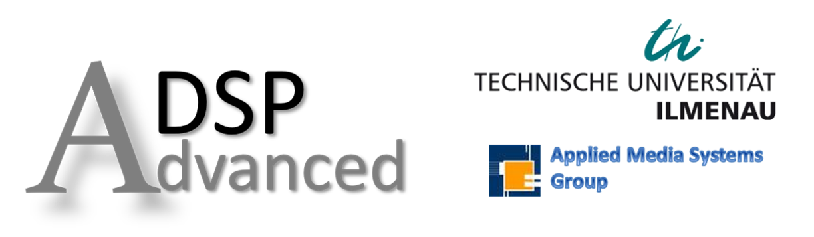

# Advanced Digital Signal Processing   Notebooks and Tutorials

    

#### Prof. Dr. -Ing. Gerald Schuller   Jupyter Notebooks and Videos: Renato Profeta
[Applied Media Systems Group](https://www.tu-ilmenau.de/en/applied-media-systems-group/)  
[Technische Universität Ilmenau](https://www.tu-ilmenau.de/)

# Content
- 01 Quantization:  

  - Introduction
  - Quantization Error
  - Uniform Quantizers: Mir-Rise and Mid-Tread
  - Python Example: Uniform Quantizers
  - Python Example: Real-time Quantization Example
  
- 02 Quantization - Signal to Noise Ratio (SNR):  

  - Signal to Noise Ratio (SNR)
  - SNR for Uniformly Distribution Signals
  - SNR for a Sine Wave
    - PDF of Time Series
    
- 03 Quantization - Non-Uniform Quantization:  

  - Companding
      - µ-LAw and A-Law
      - Python Example: µ-LAw
      - Python Example: Real-Time Mid-Tread, Mid-Rise, µ-Law

- 04r Quantization - Revision: Histogram, PDFs, Numerical Integration  

  - Histograms
  - Probability Density Functions
  - Numerical Integration
    - Riemann Sum
    - Trapezoidal Rule
 
- 04 Quantization - Lloyd-Max Quantizer  

  - Lloyd-Max Quantizer
  - Lloyy-Max Quantizer Examples
  
- 05 Quantization - Vector Quantizer (VQ) and Linde-Buzo-Gray (LBG) Algorithm  

  - Vector Quantization
  - Linde-Buzo-Gray Algorithm
  - Python Examples: Vector Quantization in an Encoder and Decoder
    - Iron Maiden - The Number of the Beast Introduction 
    - Iron Maiden - Aces High Introduction
    
- 06 Sampling - Sampling a Discrete Time Signal 

  - Sampling Introduction
  - Sampling a Discrete Time Signal
    - Downsampling
    - Upsampling
  - Python Example: Live Spectrogram: Sampling, LP Filtering
  
- 07a The z-Transform - Theory and Properties 

  - The z-Transform Definition
  - Properties of the z-Transform
    - Shift Property
    - Linearity
    - Convolution
  - z-Transform Example: Exponential Decaying Sequence
  
- 07b Filters - FIR and IIR Filters 

  - Filters: Linear Time-Invariant Systems
  - Finite Impulse Response (FIR) Filters
  - Infinite Impulse Response (IIR) Filters 
  - Filter Example: Exponential Decaying Signal
    -  Computing the Resulting Frequency Response
    - The z-Plane
    - Impulse Response
  
 # YouTube Playlist
 
 
# Requirements
Please check the following files at the 'binder' folder:
  - environment.yml
  - postBuild
  
 # Note
 Examples requiring a microphone will not work on remote environments such as Binder and Google Colab. 
